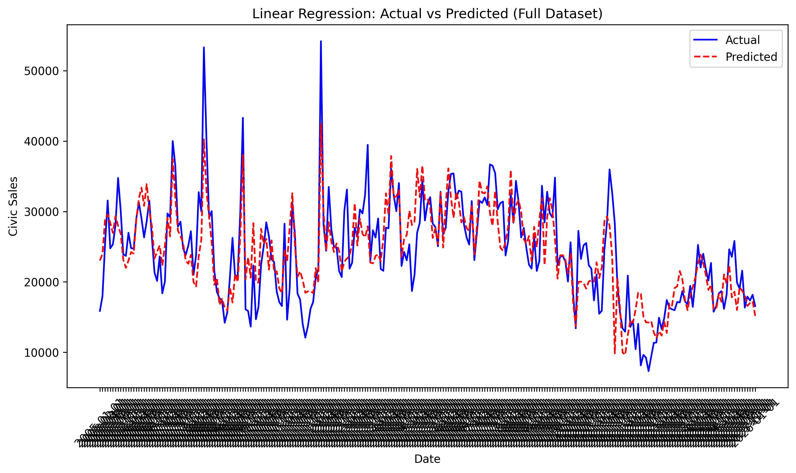
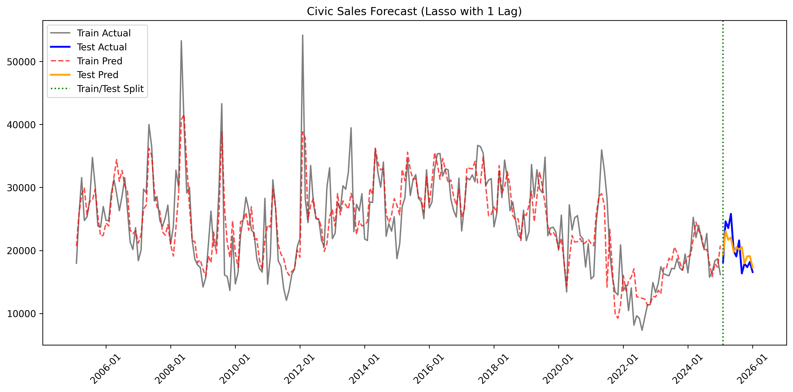
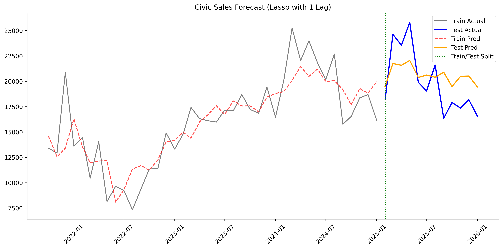

# Predicitng The Total Number of Honda Civic Sales in the United States
Utililzing key metrics and similar car models we aimed to predict the total number of Honda Civics sold in the United States. Our key metrics included the Core CPI, federal funds rate, gas price, unemployment rate, CSI, and the TDSP. While we used the Nisssan Sentra and Toyota Corrola as our comparable car models.

## I. Data
### Data Sources
For our key metrics we utilized the Federal Reserve Bank of St. Louis (FRED) data provided on their website. Links to each specific dataset are provided below:   
Core CPI: https://fred.stlouisfed.org/series/CPILFESL  
Federal Funds Rate: https://fred.stlouisfed.org/series/FEDFUNDS  
Gas Prices: https://fred.stlouisfed.org/series/GASREGW  
Unemployment Rate: https://fred.stlouisfed.org/series/UNRATE  
CSI: https://fred.stlouisfed.org/series/UMCSENT  
TDSP: https://fred.stlouisfed.org/series/TDSP  

For our data on the total unit sales in the United States of the Honda Civic, Nissan Sentra, and Toyota Corrola we utilized the GoodCarBadCar Automotive Sales Data website. Links to each specific dataset are provided below:  
Honda Civic: https://www.goodcarbadcar.net/honda-civic-sales-figures/  
Nissan Sentra: https://www.goodcarbadcar.net/nissan-sentra-sales-figures/  
Toyota Corrolla: https://www.goodcarbadcar.net/total-toyota-corolla-sales-figures-usa-canada/  

### Data Collection
Our key metric datasets were downloaded directly in CSV format from their respective FRED webpages. Our car sales data was downloaded from GoodCarBadCar in an excel worksheet format. From the excel format, we exported the file as a CSV for consistenty across our datasets. After we had all our data in a CSV format we ran our data cleaning file (data/data_cleaning.py) to create a combined table (data/combined_table.csv) to utilize for our modeling and analysis.

### Limitations of Data
1. The TDSP data was measured at a quarterly frequency which is inconsistent with our car sale data which is measured monthly. To account for this, we generalized the TDSP data monthly through a value assumption of consistent TDSP measures across each month of the quarter. A second factor we had to consider was that the last tracking period of the dataset was July 2025. To avoid implicit bias through months beyond July 2025, we ensured our train data consisted of earlier monthly data only to retain validity of our predictions
2. The Nissan Sentra model sales data concluded with December 2025 unlinke the data for the Honda Civic and Toyota Corolla which concluded with January 2026. To create consistency among the car sales data, we forward filled the Sentra data to match the Sentra December 2025 data. Similarly to the TDSP limiation, we ensured our train data did not consistent of this specific data point.
3. Another limitation is the small number of total observations. Monthly car sales begin in January 2005, which gives a moderate but still limited time-series sample, especially once lags and a holdout test set are introduced. This restricts the ability of more flexible models to learn complex patterns and makes overfitting a recurring concern. The issue is especially important because our final test set contains only 12 observations, so model comparisons are informative but should still be interpreted with caution.  
4. Economic impacts such as the COVID-19 pandemic, the housing crisis, or the chip shortage can cause greater flucuations over specific time frames in the data that is not explained wihtin our key metrics. 

### Glossary 
CPI - The Consumer Price Index  
CSI - Consumer Sentiment Index  
TDSP - Percent Household Debt of Disposable Income  

## II. Model Analysis 
*explanations, evaluations, limitations*
### Linear Regression
The linear regression acted as our baseline model. No adjustemnts to weights, addition of dummy variables, or any other modifications were added to improve performance. The model took the following form, with all variables being included in the regression:

Civic_sales = 𝛼 + β1(corrola_sales) + β2(sentra_sales) + β3(cpi) + β4(fedfunds) + β5(gas) + β6(unemploy) + β7(csi) + β8(tdsp) + ε

The regression itself suffers from multiple issues, all of which likely impact the model's predictive capabilities. The model suffers from both autocorrelation (because we regressed trends) and multicollinearity. This makes it hard to interpret the regression output or draw conclusions from many of the coefficients.

In terms of predictive capabilities, the model produces the following results:  
Train MSE: 17646666.70  
Test MSE: 10291781.38  
Root Train MSE: 4200.79  
Root Test MSE: 3208.08  
R-squared: 0.67  

The first plot shows the overall fit of the linear regression model on the dataset. 

While the model does appear to fit the actual data decently well. During periods of shocks, however, the model fails and often desyncs from the data. This creates points of extreme differences, and as such, hurts the model's prediction abilities as these points of failure compound. 
This becomes far more evident when we zoom into the model's prediction for 2025 sales, as can be seen below:

Visually, the model is far more disjointed than in the overall dataset, especially from March 2025 to October 2025. This is likely a result of the model failing to account for seasonal changes in sales, and as such, the model becomes significantly less accurate. 

Overall, the linear regression acts as a good standard for assessing the performance of the other models, however, it loses its predictive strength in e face of shocks or extreme peaks in sales figures. While adjustments such as adjusting for seasonality may improve its performance, those are out of the scope of this project. 

### LASSO
We estimated a LASSO regression model to predict monthly Honda Civic sales using competitor sales, macroeconomic indicators, and a lagged value of Civic sales. Because LASSO is sensitive to scale, all predictors were standardized before estimation, and the penalty parameter was selected using time-series cross-validation. Among the lag structures we tested via grid search (0 to 5), the best specification used 1 lag of Civic sales, which helped the model capture persistence in monthly demand while keeping the model relatively simple.

For our preferred lag-1 LASSO specification, the model achieved:  
- Optimal lambda: 24.42    
- Features kept: 7 of 8  
- Train MSE: 14,481,457.06  
- Test MSE: 3,976,307.62  
- Train RMSE: 3,805.45  
- Test RMSE: 1,994.07  
- est R^2: 0.583  
  

The above plot above is used to evaluate the predictive strength of the LASSO model. It shows that the model tracks the recent test-period movement in Civic sales reasonably well and performs much better than our naive linear regression benchmark. This is also reflected in the metrics: LASSO reduced test MSE substantially relative to linear regression, showing that adding regularization and a lagged Civic sales term improved out-of-sample prediction by a large margin. For this reason, LASSO became our strongest interpretable machine-learning model.

The first plot also reveals an unusual pattern: the model’s training MSE is larger than its test MSE. While that initially seems counterintuitive, the graph suggests a clear explanation. The training period covers a much longer and more volatile historical sample, including larger spikes and sharper swings in Civic sales, while the final 12-month test period is comparatively smoother. In that setting, a regularized model like LASSO may fit the noisier historical period less closely while still forecasting the calmer recent period relatively well.

The second plot was created to investigate this unusual MSE pattern. To do this, we re-estimated the same LASSO model with 1 lag using only the most recent 40 training observations, dropping the first 200 periods from the original sample. This robustness check was meant to test whether the earlier historical data were inflating the full-sample training error.

Once we restricted the model to recent training data, the more typical pattern of train MSE (5.29M) < test MSE (6.58M) reappeared. This supports the interpretation that the original full-sample result was driven by the much greater volatility of the older data, rather than by a coding or implementation problem. At the same time, the model’s overall predictive performance became worse, so this reduced-sample version is best viewed as a diagnostic exercise rather than a superior forecasting model.

Overall, LASSO with 1 lag of Civic sales is a strong and interpretable forecasting model. It improved substantially over naive linear regression, captured persistence in monthly sales, and delivered strong out-of-sample performance while remaining relatively simple through regularization. Although SARIMAX with a shock dummy (See next section) achieved the best final forecasting accuracy in the end, LASSO remained our preferred interpretable machine-learning benchmark.

### Time Series (ARIMA)

### Random Forest 

### Decision Tree

## III. Recomendations 

### Mean Squared Error Table

Our models produced the following Train MSEs, Test MSEs, Train RMSEs, and Test RMSEs:

| Model | Train MSE | Test MSE | Train RMSE | Test RMSE|
| --- | --- | --- | --- | --- |
| Linear Regression | 17,646,666.70 | 10,291,781.38 | 4,200.79 | 3,208.08 |
| L.A.S.S.O. | 14,481,457.06 | 3,976,307.62 | 3,805.45 | 1,994.07 |
| Decision Tree | 6,446,715.16 | 11,763,324.31 | 2,539.04 | 3,429.77 |
| Random Forest | 2,287,625.71 | 7,621,517.15 | 1,512.49 | 2,760.71 |
| SARIMAX + Shock Dummy | 29,392,150.73 | 2,936,170.34 | 5,421.37 | 1,713.75 |

Among the models we tested, SARIMAX with a shock dummy produced the best pure forecasting performance, achieving the lowest test MSE and RMSE in our . This suggests that explicitly modeling time-series dynamics and accounting for abnormal periods such as COVID can materially improve predictive accuracy. At the same time, we do not view this result as meaning that SARIMAX is the only path forward. A significantly contributing reason for its strong performance is that it benefited substantially from the inclusion of a shock dummy, and that same idea could also be incorporated into other models, including LASSO, linear regression, and tree-based methods. In that sense, part of SARIMAX’s advantage likely reflects the value of better feature design, not just the model class itself.

For the overall project, we lean more heavily toward LASSO with 1 lag of Civic sales as the most useful benchmark moving forward. LASSO dramatically improved on naive linear regression, remained relatively interpretable, and captured persistence in monthly sales while controlling model complexity through regularization. It gives us a strong balance of prediction, simplicity, and feature selection, which makes it especially attractive for future refinement. There is also clear room to improve it further: adding shock dummies, seasonality controls, and possibly lagged versions of selected explanatory variables could help LASSO close part of the remaining gap with SARIMAX. For that reason, our practical recommendation is to treat SARIMAX + shock dummy as the strongest current forecasting model, while viewing lagged LASSO as the most promising and expandable interpretable model for future development.

## IV. Modeling Limitations and Potential Extensions
Our modeling process has a few important limitations that also point directly to natural extensions. First, due to time constraints, we were not able to fully optimize every model. A broader search over lag structures, hyperparameters, and alternative specifications could improve performance further, especially for models like LASSO and Ridge.

Second, most of our models relied on relatively simple additive relationships. We did not systematically test interaction terms, richer nonlinear transformations, or more detailed seasonal structure, even though these could matter for monthly car sales. Extending the feature set in those directions could help the models capture more realistic sales dynamics.

Third, while we added a lag of Civic sales in LASSO, we did not fully explore lagged explanatory variables, shock indicators, or seasonal dummies across all models. This is especially relevant because SARIMAX appears to have benefited greatly from the inclusion of a shock dummy, suggesting that similar additions could also improve LASSO, linear regression, and other methods.

Finally, our evaluation was based on a relatively limited set of forecast comparisons. Future work could test the best-performing models over longer future periods, apply them to other vehicle models, and examine whether the model rankings remain stable under alternative validation windows. In this sense, the current project should be viewed as a strong starting point, with clear room for refinement and expansion.

## V. Rerun Instructions
### Requirements 
Your code will be executed in a Python environment contatining the Standard Library and the packages specified in `requirements.txt`. Install them with pip install -r requirements.txt.

### Data Collection and Cleaning
The data is uploaded within this repo in the raw_data folder (data/raw_data). The original files themselves can be retrived from the links provided with the Data Sources section of this readme. To clean the data, run our `data/data_cleaning.py` which can be found in our data folder. Running the cleaning file will produce `data/combined_table.csv` that combines all our datasets and provides clean data ready for modeling and analysis

### Modeling and Visualization 
#### Linear Regression  

#### Lasso  
Running `models/lasso.py` will re-estimate the LASSO forecasting model using the cleaned `data/combined_table.csv` dataset. The script standardizes the predictors, performs a grid search over lag specifications for Civic sales, and uses LassoCV with TimeSeriesSplit to choose the optimal regularization parameter for each lag setting. It then reports the key metrics and features for each candidate model. After identifying the preferred lag specification, the script also generates `visualization/lasso/lasso_lag1_plot.png` to present the overall fit visually.  
Furthermore, the script also performs an additional robustness check that re-fits the lag-1 LASSO after dropping the first 200 observations and keeping only the most recent training window. This produces a second set of train/test MSE results and a second forecast plot `visualization/lasso/lasso_lag1_plot_omitting_earlier_training_data.png`. 

#### Random Forest

#### Decision Tree

